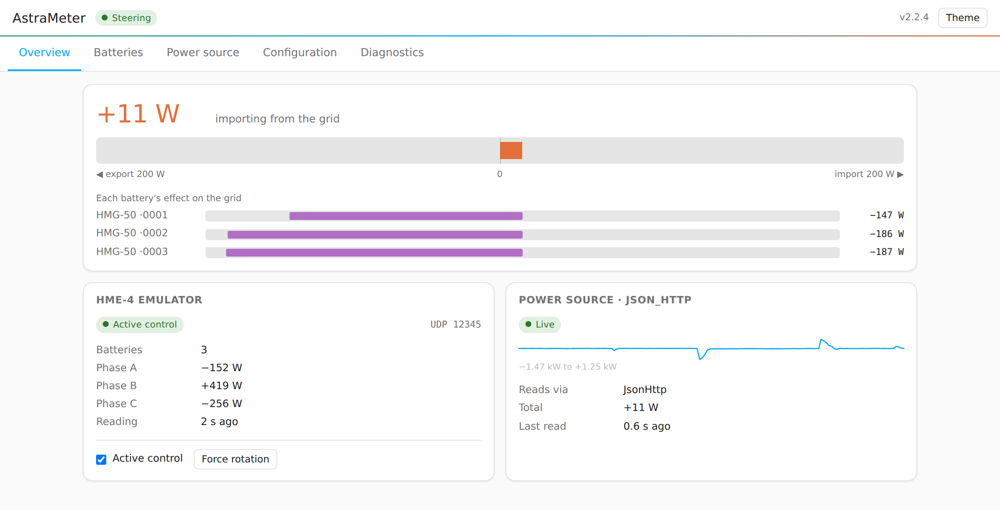

# AstraMeter

> **Formerly known as b2500-meter.** The project was renamed to reflect support
> for the full range of Marstek storage systems (B2500, Jupiter, Venus, …), not
> just the B2500.

AstraMeter emulates Smart Meter devices for Marstek storage systems such as the
B2500, Jupiter, and Venus, while letting you feed it from almost any real smart
meter. Your storage system sees a meter it understands; AstraMeter reads your
actual grid power from a source of your choosing and steers the batteries toward
net-zero grid exchange.

<picture>
  <source media="(prefers-color-scheme: dark)" srcset="docs/images/dashboard-overview-dark.png">
  
</picture>

<em>The built-in <a href="docs/dashboard.md">live status dashboard</a> — three batteries sharing one house.</em>

<!-- marstek-family:start -->
**🔋 The Marstek ecosystem.** This repo is part of a family of open-source tools for Marstek batteries (B2500, Venus, Jupiter, …):

| Project | What it does |
|---|---|
| [hm2mqtt](https://github.com/tomquist/hm2mqtt) | Brings your battery into your smart home, turning its raw data into readable sensors and controls (e.g. in Home Assistant) |
| [hame-relay](https://github.com/tomquist/hame-relay) | Connects the official Marstek cloud/app and your local smart home so both work together, forwarding data whichever way your battery is set up |
| [marsrelay](https://github.com/tomquist/marsrelay) | Runs your battery completely offline, with no internet or Marstek cloud, while still sending all its data to your smart home |
| **AstraMeter** (this repo) | Tells your battery your live grid usage (read from your existing meter) so it charges and discharges to avoid buying or selling power |
| [hmjs](https://github.com/tomquist/hmjs) | Sets up and configures B2500 batteries over Bluetooth, right from your web browser, with no app or account needed |
| [esphome-b2500](https://github.com/tomquist/esphome-b2500) | Continuously monitors and controls a B2500 over Bluetooth using a small ESP32 board |
<!-- marstek-family:end -->

It does this by emulating one or more of these devices:

- **CT002 / CT003** (Marstek's native CT protocol) — use for **multiple** storage
  devices; it coordinates a shared target across the fleet.
- **Shelly Pro 3EM** — uses port 1010 (B2500 firmware up to v224) and port 2220
  (B2500 firmware v226+); target a specific port with `shellypro3em_old` (1010) or
  `shellypro3em_new` (2220).
- **Shelly EM gen3**
- **Shelly Pro EM50**

> **Which device type?** Use **CT002**/**CT003** when you steer **multiple**
> storage devices; use a **Shelly** type (`shellypro3em`, `shellyemg3`,
> `shellyproem50`, …) otherwise. See
> [CT002 / CT003 steering](docs/ct002.md) and the
> [Configuration reference](docs/configuration.md).

## ⚡ Quick start with the config generator

The easiest way to get going is the
[**config generator**](https://astrameter.com/generator.html): a
beginner-friendly tool that asks a few questions about your power meter and
produces a ready-to-use `config.ini` (Home Assistant add-on / Docker / direct
install) or ESPHome YAML, explaining each option as you go. It runs entirely in
your browser — nothing is uploaded — and you can save, share, and reload your
answers.

## Installation

AstraMeter can be installed and run in several ways:

| Method | Best for | Guide |
|--------|----------|-------|
| **Home Assistant add-on** | Home Assistant users (easiest) | [docs/installation/home-assistant.md](docs/installation/home-assistant.md) |
| **Docker** | Standalone server deployment | [docs/installation/docker.md](docs/installation/docker.md) |
| **Direct (Python)** | Development or custom setups | [docs/installation/direct.md](docs/installation/direct.md) |
| **ESPHome on an ESP32** | A dedicated board, no server | [docs/installation/esphome.md](docs/installation/esphome.md) |

When AstraMeter is running, switch your Marstek battery to "Self-Adaptation" mode
to enable the powermeter functionality.

## Supported power meter sources

AstraMeter reads your real grid power from a wide range of sources. The full
per-source `config.ini` reference lives in
**[docs/powermeters.md](docs/powermeters.md)**; for the ESPHome external
component, see **[docs/esphome-powermeters.md](docs/esphome-powermeters.md)**.

Supported sources include: Shelly, Tasmota, Shrdzm, Emlog, ioBroker, Home
Assistant, VZLogger, ESPHome (Http-Polling or native API), AMIS Reader, Modbus (TCP/UDP), MQTT, JSON HTTP, TQ
Energy Manager, HomeWizard, Enphase Envoy, SMA Energy Meter, FRITZ!Smart Energy
250, Fronius Smart Meter, Refoss / Meross energy monitors, Tibber Pulse, Script,
and SML.

## Configuration

Configuration is managed via a `config.ini` file (or ESPHome YAML on an ESP32).
Start with the [**config generator**](https://astrameter.com/generator.html),
then consult the reference docs as needed:

- **[Configuration reference](docs/configuration.md)** — general options, value
  transformation, the PID controller, and running multiple powermeters.
- **[Powermeter sources](docs/powermeters.md)** — the `config.ini` section for
  each supported meter.
- **[CT002 / CT003 steering](docs/ct002.md)** — the CT emulator, active control,
  multi-battery balancing, efficiency optimization, and Marstek cloud
  registration.
- **[Live status dashboard](docs/dashboard.md)** — the built-in web UI showing
  live grid and per-battery state, and editing your configuration from the
  browser. On by default in the Home Assistant add-on and in Docker or
  standalone runs; an ESP32 can serve it too.
- **[MQTT Insights & Home Assistant entities](docs/mqtt-insights.md)** —
  publishing internal state to MQTT, HA Device Discovery, and per-battery
  controls.
- **[ESPHome powermeter sources](docs/esphome-powermeters.md)** — the equivalent
  grid-power `sensor:` configuration on an ESP32.

## Testing without hardware

The bundled **[simulator](docs/simulator.md)** (`astra-sim`) simulates N batteries
speaking the CT002 UDP protocol and serves a powermeter endpoint, so you can
exercise the full emulator and balancer end-to-end without any real devices.

## Help & reference

- **[FAQ & troubleshooting](docs/faq.md)** — setup problems, firmware
  requirements, oscillation/yo-yo fixes, and more.
- **[CT002/CT003 UDP protocol](docs/ct002-ct003-protocol.md)** — the wire
  protocol used by Marstek storage systems.
- **[Marstek MQTT & HTTP protocol](docs/marstek-mqtt-http.md)** — the cloud/app
  protocol.
- **[Contributing](CONTRIBUTING.md)** — development workflow and the
  Python ↔ ESPHome parity rules.

## License

This project is licensed under the General Public License v3.0 — see the
[LICENSE](LICENSE) file for details.
