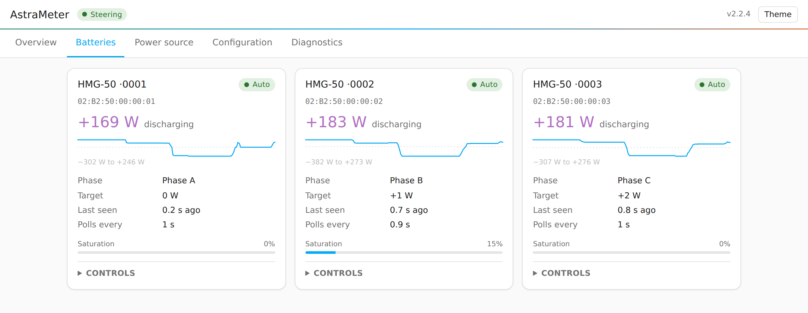
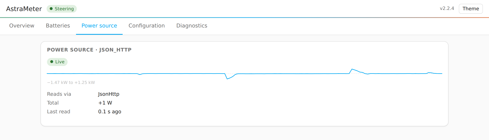
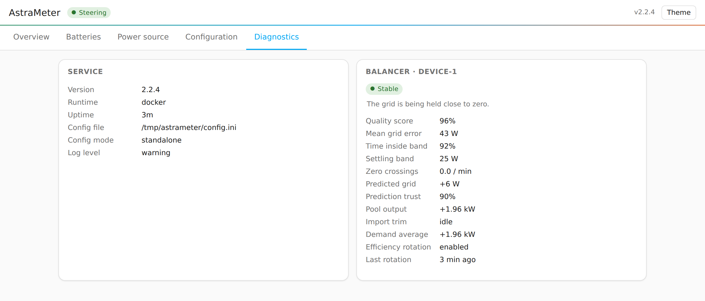

# Live status dashboard

A web page that shows what AstraMeter is doing right now — grid power,
every battery's target and reported power, the health of your power source, and
the balancer's internal state — and lets you change your configuration without
editing files by hand.

## Contents

- [What it shows](#what-it-shows)
- [Enabling it](#enabling-it)
  - [Home Assistant add-on](#home-assistant-add-on)
  - [Docker / standalone](#docker--standalone)
  - [ESPHome on an ESP32](#esphome-on-an-esp32)
- [Changing your configuration](#changing-your-configuration)
  - [Guided setup](#guided-setup)
  - [Config file](#config-file)
  - [Switching between them](#switching-between-them)
- [Security](#security)
  - [Writes are refused to other websites](#writes-are-refused-to-other-websites)
  - [Only addresses that cannot be pointed here](#only-addresses-that-cannot-be-pointed-here)
- [Troubleshooting](#troubleshooting)

## What it shows

**Overview** — the headline is a single signed bar with zero pinned at the
centre: export to the left, import to the right. Underneath, each battery's
effect on the grid is drawn on that same axis, so you can see at a glance that
the batteries are what pull the grid back to zero. Beside it are the emulator's
state (active control or relay mode, batteries connected, per-phase readings)
and the power source's health.

<picture>
  <source media="(prefers-color-scheme: dark)" srcset="images/dashboard-overview-dark.png">
  
</picture>

**Batteries** — one card per battery: reported power, the target AstraMeter
asked for, the phase it reported, how long ago it last polled, its distribution
weight and its saturation. If changes are allowed you can disable a battery or
return one to automatic control from here.

<picture>
  <source media="(prefers-color-scheme: dark)" srcset="images/dashboard-batteries-dark.png">
  
</picture>

**Power source** — every configured meter, what reads it, the filter chain
applied to it (smoothing, spike rejection, PID) and when it was last read.

<picture>
  <source media="(prefers-color-scheme: dark)" srcset="images/dashboard-sources-dark.png">
  
</picture>

**Diagnostics** — service version, the commit the build came from (for a
released image or a firmware compiled from a checkout), uptime, config file and
mode, plus the balancer's internals. Each balancer card leads with its **control quality**:
whether the grid is being held at zero, with the mean error, time inside the
band and zero-crossing rate behind it (see
[Control quality](ct002.md#control-quality)), followed by the predicted grid
power, prediction trust, pool output, import trim, the demand average and the
efficiency rotation state. MQTT Insights connection state appears here when it
is configured.

<picture>
  <source media="(prefers-color-scheme: dark)" srcset="images/dashboard-diagnostics-dark.png">
  
</picture>

The battery and power-source cards each carry a small **trend line** of their
own figure, with the range it covered underneath. It is built in your browser
from the readings the page has already polled — nothing is stored, so it starts
empty on every load and covers only as long as the tab has been open.

Values a backend cannot supply are **omitted**, never shown as `0` or `—`, so
an empty field always means "not reported" rather than "measured as zero".

## Enabling it

### Home Assistant add-on

It is **always on** — the add-on's sidebar panel *is* the dashboard, so there is
no option to turn it off. Open **AstraMeter** in the Home Assistant sidebar; the
page is served through Home Assistant ingress, so it needs no extra port and is
covered by your normal Home Assistant login.

Two add-on options control it:

| Option | Default | What it does |
|---|---|---|
| `dashboard_allow_write` | `true` | Lets the dashboard change configuration and control batteries. Turn it off for a read-only dashboard. |
| `dashboard_direct_access` | `false` | Also serves the page on `http://<host>:52500` **with no authentication**. See [Security](#security). |
| `dashboard_allowed_hosts` | empty | Extra host names that port answers under, comma-separated. IP addresses, `localhost`, `.local` and `.home.arpa` names always work — needed for a reverse proxy, a private DNS entry, or a router-assigned name such as `astrameter.fritz.box`. See [Security](#only-addresses-that-cannot-be-pointed-here). |

This holds for a `custom_config` file too: `DASHBOARD_ENABLED` and
`ENABLE_WEB_SERVER` in that file are ignored, because the sidebar panel and the
Supervisor's health check both depend on them. The file's
`DASHBOARD_ALLOW_WRITE` and `DASHBOARD_DIRECT_ACCESS` still apply, and both
default the same way the add-on options do — writes on, direct access off.

### Docker / standalone

**On by default, and able to change things** — open `http://<host>:52500/`.
The port follows `WEB_SERVER_PORT`. Nothing else is needed: outside the add-on
there is no Home Assistant in front of the page, so this address is the
dashboard, unauthenticated — see [Security](#security).

Keys in `[GENERAL]` narrow it:

```ini
[GENERAL]
# Read-only: show everything, change nothing (default True).
DASHBOARD_ALLOW_WRITE = False
# Stop serving the dashboard — only the health check is left, plus the
# standalone config editor if WEB_CONFIG_ENABLED is on (default True).
DASHBOARD_ENABLED = False
# Drop the Configuration tab and the /config editor behind it, keeping the
# rest of the page. Left unset it follows DASHBOARD_ENABLED above; set it to
# True to keep /config served even with the dashboard off.
WEB_CONFIG_ENABLED = False
# Extra host names this port answers under, comma-separated. IP addresses,
# localhost, .local and .home.arpa names always work, so this is only needed
# if you reach the dashboard through a reverse proxy, a private DNS entry, or
# a router-assigned name such as astrameter.fritz.box.
DASHBOARD_ALLOWED_HOSTS = astrameter.example.lan
```

`WEB_CONFIG_ENABLED` decides whether there is a configuration surface at all,
not whether the page may write. It has three states: left out it follows the
dashboard, `True` serves the editor even with `DASHBOARD_ENABLED = False`, and
`False` refuses it even with the dashboard on. If you set it in an earlier
release, it still means what it said — the dashboard does not override it.

That makes it the narrower of the two switches: `DASHBOARD_ALLOW_WRITE = False`
makes the whole page read-only, batteries included, while `WEB_CONFIG_ENABLED =
False` leaves the battery controls working and takes only the configuration
away.

### ESPHome on an ESP32

On by default — there is nothing to add. Flash a `ct002:` configuration and
open `http://<device>/`: the same page, served straight from the ESP32's flash.

To leave it out of the firmware entirely, taking the web server and the page
with it:

```yaml
ct002:
  power_sensor_l1: grid_l1
  dashboard: false
```

**Nothing else is required** — no MQTT broker, no Home Assistant, no second
component. The board serves the page itself, and with `controls: true` below it
is also a complete way to steer your batteries, so MQTT Insights is an option
rather than a prerequisite.

The board serves a **reduced version** of the page. Everything it can measure
is there — grid power, every battery with its target and saturation, the
balancer's internals and its [control-quality verdict](ct002.md#control-quality),
the health of the grid-power sensor, plus MQTT Insights' connection state for
those who run that sub-block — but:

- **There is no Configuration tab.** An ESPHome device's settings are compiled
  into its firmware, so there would be nothing to save; change your YAML and
  re-flash instead.
- **The page is read-only until you say otherwise.** Add `controls: true` to
  steer batteries from it — see below.
- **Times are relative** ("4 s ago") rather than clock times until the device
  has a synced clock; add ESPHome's [`time:`](https://esphome.io/components/time/)
  component if you want absolute timestamps.

| Option | Default | What it does |
|---|---|---|
| `controls` | `false` | Lets the page change batteries: manual target, auto/manual, active, distribution weight, efficiency window, min DC output, and the device's active control / force rotation. |
| `path` | `/`, or `/astrameter` when `web_server:` is configured | Where the page is mounted. |
| `allowed_hosts` | empty | Extra host names the device answers under. Its IP address, `localhost`, its `.local` mDNS name and any `.home.arpa` name always work — needed behind a reverse proxy or for a router-assigned name. See [Security](#only-addresses-that-cannot-be-pointed-here). |
| `web_server_link` | `true` | Adds a link to the dashboard at the top of ESPHome's own page. Only does anything when `web_server:` is configured. |
| `id` | generated | The usual ESPHome component id. |

```yaml
ct002:
  power_sensor_l1: grid_l1
  dashboard:
    controls: true
```

Controls are off by default because the page has **no login of its own** — see
[Security](#security). They accept exactly the values the MQTT entities and the
Python dashboard accept, and — when `mqtt_insights:` is configured — a change
made here is written back to the broker's retained command topic, so it is not
something the next reconnect quietly reverts.

The dashboard shares ESPHome's HTTP server with `web_server:` and
`captive_portal:`, so they all use one port. `web_server:` already serves
ESPHome's own page at `/`, and only one handler can have a URL — so on a device
that has one, the dashboard moves itself to `http://<device>/astrameter/`
rather than contesting the root. The address it settled on is in the boot log:

```text
[astrameter.dashboard]: AstraMeter dashboard:
[astrameter.dashboard]:   URL: http://<device>:80/astrameter/
```

Set `path:` yourself to put it somewhere else. Asking for `path: /` while
`web_server:` is configured is refused at validation time rather than letting
the two race.

So that the moved page is not hidden behind a URL you have to already know,
**ESPHome's own page gets a link to it** at the top — no configuration, and
nothing to keep in step if you change `path:`. Set `web_server_link: false`
under `dashboard:` if you would rather it stayed as ESPHome ships it. Two
`web_server:` settings leave the link out, because neither serves a page that
can carry it: `version: 1`, whose page never loads added scripts, and
`local: true`, which serves a prebuilt one. Neither is an error — the compile
log says so, and the dashboard is reachable at its own URL regardless.

It costs about 90 KiB of flash — the compressed page plus ESPHome's HTTP
server — and no measurable RAM while nobody is watching. An ESP32 with 4 MB is
comfortable; ESP8266 is not supported, and neither are boards too tight for the
extra 90 KiB, which is what `dashboard: false` is for.

## Changing your configuration

The Configuration tab adapts to how AstraMeter is configured. It is absent
entirely on ESPHome, where the configuration lives in the firmware.

### Guided setup

In the Home Assistant add-on with no custom config file, the tab shows a form
built from the add-on's own options — the same settings as the add-on's
Configuration page, with labels and help text. Saving writes them back through
the Supervisor and restarts the add-on, which can take a minute.

The form opens on the two groups a working setup needs — **Grid measurement**
and **Emulated meter** — and folds the rest away behind named, counted
headings: battery control, meter reading, signal filters, balancer tuning,
Marstek's cloud, and the add-on's own settings. Open one to see its fields.
Every setting says what it does underneath, and a box left empty shows the
value that applies instead of it, so `0.2` in a greyed-out **Balance gain**
means that is what you get by leaving it alone.

The form is generated from the add-on's live option schema, so a new option
appears here as soon as the add-on gains it — in a trailing **Other** group
until it is given a description.

**Grid power sensor** and **Export power sensor** are entity pickers rather
than text boxes: they list the Home Assistant entities that could plausibly
carry grid power — anything with `device_class: power`, plus anything reading
in a unit AstraMeter converts (`W`, `kW`, `MW`, `mW`) — showing each one's
friendly name and current value. The picker does not restrict the domain, so a
`number.` entity carrying watts is offered too. Type to filter the list, then
click or tap the one you want — the same list on a phone as on a desktop. You
can still enter an entity id by hand, and if the configured one is not
currently known to Home Assistant the field says so instead of letting you find
out at the next restart.

A `kW`, `MW` or `mW` sensor is converted to watts for you, so **do not** set
`POWER_MULTIPLIER = 1000` to compensate — if you did that before AstraMeter
read units, remove it or the reading is scaled twice. An entity marked
`device_class: power` whose unit is none of those is still listed, but flagged
**not a power unit**: AstraMeter refuses to read it, and the sensor's own unit
is usually the thing to fix.

Both take **one sensor per phase**: a single sensor for a whole-house total, or
up to three for a three-phase meter. An empty picker for the next phase is
offered until you have three, and each phase can be removed again. If you use
separate import and export sensors, give both the same number of phases — they
are paired up, and a mismatch stops AstraMeter from starting.

### Config file

With a custom `config.ini` — or in Docker — the tab shows a structured editor
for that file: one collapsible card per `[SECTION]`, and a control per setting
chosen from its type, so a boolean is a dropdown, a number is a number field
and a choice is a list. Settings and whole sections can be added and removed,
and the name box suggests the settings AstraMeter knows for that section. It is
the same editor as the standalone one at `/config`.

Saving trial-loads the whole file before replacing it, so a file that cannot
be parsed — or whose power-source sections cannot be built — is rejected and
the running configuration is left untouched. This is a load check, not a full
schema validation: a setting that parses but is wrong for your hardware is
still accepted here and will show up in the log at the next restart.

Passwords and tokens are shown as `••••••••`. Leave them untouched to keep the
stored value; the real secret is never sent to your browser and never has to be
retyped to edit an unrelated field.

### Migrating between them

Which one you want comes down to what your setup needs:

- **Guided setup** is the easy path — labelled fields, entity pickers, values
  checked before they save. Grid power has to come from a Home Assistant
  sensor, and only the settings the add-on exposes can be changed.
- **A config file** is the advanced path — everything AstraMeter can do: any
  power source, several meters at once, every setting there is. You maintain
  the file yourself, and nothing checks it until AstraMeter starts.

In the add-on, **Migrate to a config file** / **Migrate back to guided setup**
at the foot of the Configuration tab moves you between them. It is folded shut
by default: this is a one-time move, not a setting.

- **Migrating to a config file** writes the configuration that is running right
  now to `/config/astrameter.ini`, points the add-on's `custom_config` option
  at it and restarts. You start from what is actually running, not a blank
  file. An existing file with that name is never overwritten — AstraMeter then
  runs *that* file instead. The add-on options stay on the add-on's
  Configuration page but stop having any effect.
- **Migrating back to guided setup** clears `custom_config` and goes back to
  the add-on options as they stand today — your file is *not* copied into them,
  so check them first if they have not been touched in a while. The file itself
  is left on disk unchanged, and migrating to it again reads it back.

Either way you are asked to confirm first, and the add-on then restarts — the
dashboard goes quiet for up to a minute and reconnects on its own.

## Security

The dashboard has **no login of its own**. It relies on where the request came
from:

| Deployment | Reachable | Protected by |
|---|---|---|
| Add-on, sidebar (ingress) | yes | your Home Assistant login |
| Add-on, `http://<host>:52500` | only with `dashboard_direct_access` | **nothing** |
| Docker / standalone | yes, unless `DASHBOARD_ENABLED = False` | **nothing** |
| ESPHome, `http://<device>/` | yes, unless `dashboard: false` | **nothing** |

Because the add-on runs with host networking, port 52500 is on your LAN
whether or not you use it. There, everything except `/health` is refused
unless the request arrives through ingress or you explicitly opt in to direct
access. The check is the connection's source address, not a header, so it
cannot be faked by a client on your network.

Running AstraMeter yourself there is no ingress, so that port is the only way
in and the page is served on it, **writable** — anyone who can reach it can
edit your `config.ini` and steer your batteries. Set
`DASHBOARD_ALLOW_WRITE = False` on a network you do not control, or
`DASHBOARD_ENABLED = False` to show nothing at all.
`DASHBOARD_DIRECT_ACCESS` does not apply (it is only read when the add-on runs
from a config file).

On ESPHome the page exposes no configuration, and no battery controls unless
`controls: true` asks for them — but even read-only it is an unauthenticated
view of your household's power on the LAN, and with controls on, anyone who can
reach the device can re-target your batteries. If that matters, add ESPHome's
[`web_server:`](https://esphome.io/components/web_server/) with its `auth:`
block and give the dashboard a `path:` of its own: both mount on the same HTTP
server, so that login covers the dashboard too. Otherwise leave `controls:`
off, or set `dashboard: false`.

Turning off `dashboard_allow_write` keeps the dashboard readable while blocking
every configuration change and battery command.

### Writes are refused to other websites

"Anyone who can reach it" above means a person or program on your network. It
does **not** include a website you happen to visit while on that network,
which would otherwise be able to reach a LAN address through your own browser
and drive the write API without ever seeing the reply.

Every write — on all three backends — requires `Content-Type:
application/json`. That is a header a browser will not send cross-origin
without asking permission first, and no AstraMeter route grants it, so such a
request never leaves the browser. Nothing you configure turns this off, and it
applies whatever `dashboard_allow_write` is set to.

### Only addresses that cannot be pointed here

The content-type rule above stops a website driving the API *across origins*.
One attack gets around it: the site serves its page from a name it owns, then
answers the next lookup for that name with your AstraMeter's address. Your
browser now treats its page as the **same origin** as AstraMeter, so it can
send any content type it likes — and read the reply. That is your
configuration and the state of your house on the way out, and on the way in a
`[SCRIPT]` power source is a shell command AstraMeter runs.

The one part of the address the site cannot choose is the name in the `Host`
header, because the browser copies it from the URL and the URL has to carry a
name the site's own nameserver is asked about. So AstraMeter answers only
under addresses that could not have got there that way:

- **IP addresses** — no lookup happens, so there is no answer to poison.
- **`localhost`** and any **`.local`** name — `.local` is mDNS, resolved on
  your link rather than by a nameserver someone outside can answer for. This
  covers every ESPHome device, which mDNS names automatically.
- Any **`.home.arpa`** name — the suffix reserved for home networks
  ([RFC 8375](https://www.rfc-editor.org/rfc/rfc8375)). The DNS root delegates
  it to nobody, so there is no outside nameserver to poison.
- **Names you list yourself**, for a reverse proxy, a private DNS entry, or a
  name your router hands out — `astrameter.fritz.box` and `nas.lan` are
  refused until you list them, because `.box` is a real top-level domain and
  `.lan` an ordinary label, so unlike the three above a nameserver *can* be
  asked about them:
  `DASHBOARD_ALLOWED_HOSTS` (comma-separated) in `config.ini`,
  `dashboard_allowed_hosts` in the add-on, `allowed_hosts:` under the ESPHome
  `dashboard:` block.

Anything else gets a `403` naming the address it refused. Two things are exempt:
the **`/health` endpoint**, which your monitoring reaches under whatever name it
likes and which exposes nothing, and the **Home Assistant sidebar** — ingress
arrives under whatever name you reach Home Assistant by, and it is already
authenticated.

Reads are a different matter, and only on ESPHome: that HTTP server sends
`Access-Control-Allow-Origin: *` on every response, so `/api/status` is
readable by any website you visit while on the same network — it reports your
device name, battery addresses, MQTT broker and live household power. Either
`dashboard: false` or ESPHome's `web_server:` with an `auth:` block closes
that. The Python service sends no such header, so its status is readable only
from your network.

## Troubleshooting

**The sidebar panel is missing.** Restart the add-on; the panel is registered
at start-up.

**"Not reachable from here."** In the add-on you opened
`http://<host>:52500` directly rather than through the sidebar. Either use the
sidebar or turn on `dashboard_direct_access`, understanding that it is
unauthenticated. Running AstraMeter yourself this does not apply — if that
address is refused, check that AstraMeter is running, that you are on the port
`WEB_SERVER_PORT` gives it, and that nothing sets `DASHBOARD_ENABLED = False`.

**"Unrecognised address."** You opened the dashboard under a host name rather
than an IP address, and that name is not one AstraMeter answers under — see
[Security](#only-addresses-that-cannot-be-pointed-here). Use the IP address, or
add the name to `DASHBOARD_ALLOWED_HOSTS` (`dashboard_allowed_hosts` in the
add-on, `allowed_hosts:` on ESPHome). A name your router hands out, such as
`astrameter.fritz.box`, needs listing like any other.

**The Configuration tab is gone.** `WEB_CONFIG_ENABLED = False` is set — it
takes the tab and the `/config` editor with it, leaving the rest of the page.
Remove the line to have it follow the dashboard again.

**"Lost contact with AstraMeter."** The page could not reach the service for
two polls. It keeps retrying, dims the values and switches every relative time
to an absolute clock time so a stale reading cannot be mistaken for a fresh one.

**The Configuration tab is read-only.** `dashboard_allow_write` (or
`DASHBOARD_ALLOW_WRITE`) is off.

**Saving config.ini is refused in the add-on.** You are in guided-setup mode,
where the add-on regenerates `config.ini` on every start — an edit there would
be lost at the next restart. Use the guided form, or switch to a config file.
